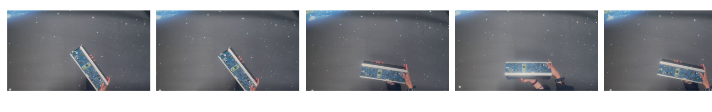
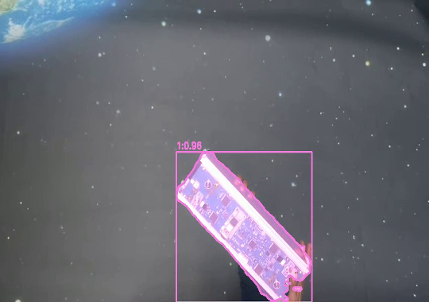
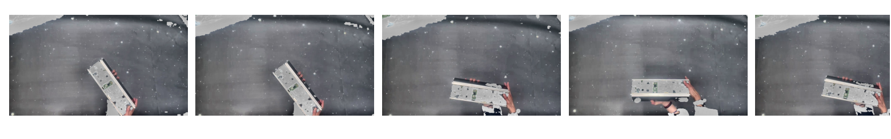
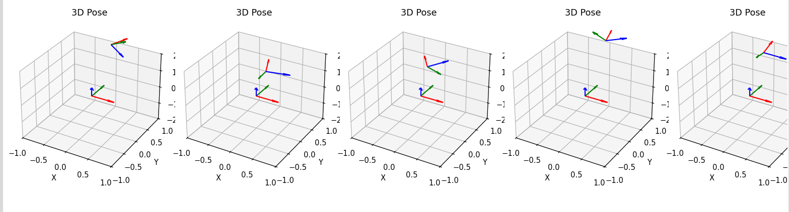
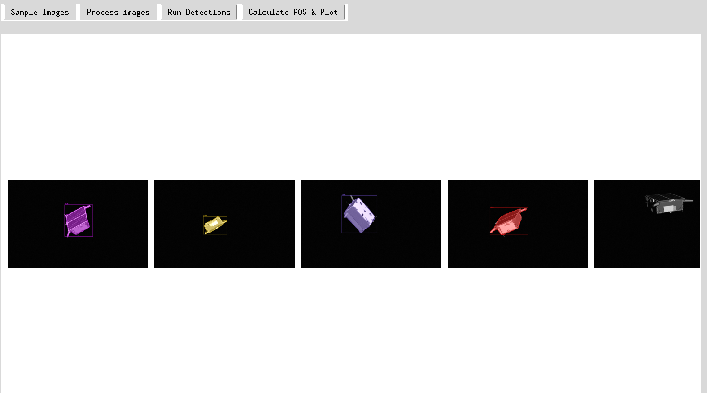
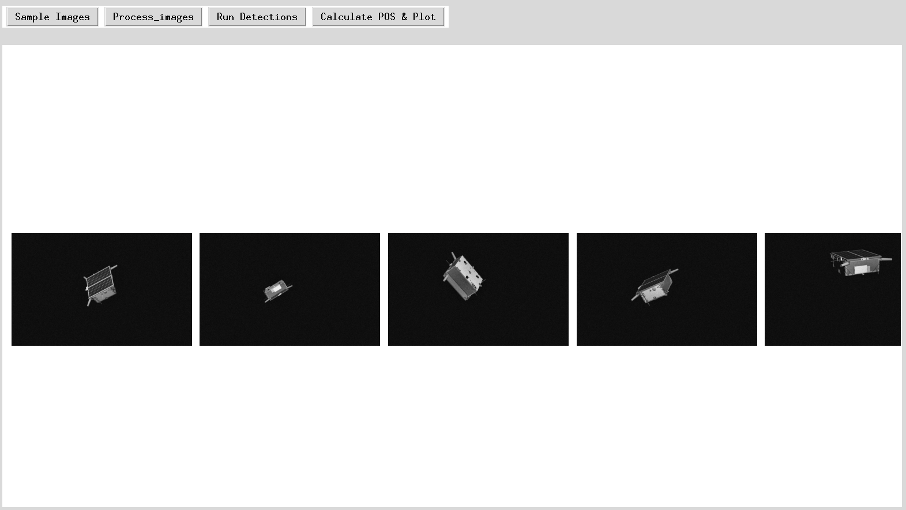
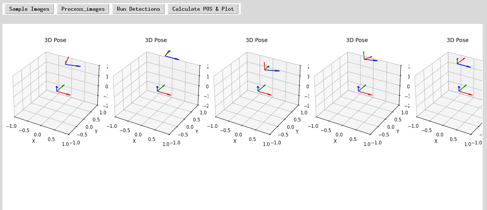

# 6D Object Pose Estimation for Space Applications using Poet + Mask R-CNN

This repository provides a **real‑time 6D pose estimation pipeline** tailored for space environments using **Poet** (single RGB image) + **Mask R-CNN** as the 2D detector. The model has been pre‑trained/fine‑tuned on **SPEED** and **LAB** datasets for space‑relevant objects.

> **Note**: Poet is **not** our own model. We use the original Poet architecture and have fine‑tuned it on space‑domain datasets. Full credit goes to the original Poet authors.

---

## Pipeline Overview

Our complete pipeline consists of:

1. **Bounding Box Detection** – Mask R‑CNN localizes objects in the RGB image.
2. **Multi‑Orientation Sampling** – For each detected object, we sample multiple orientations from the pose distribution.
3. **Processing** – Each sampled orientation is processed through the Poet network.
4. **Orientation Prediction** – The network outputs predicted 6D poses for each sampled image.

---

## Key Features (inherited from Poet)

- Single RGB image input – no depth sensors or 3D models required.
- Multi‑scale feature maps incorporate global scene context.
- Real‑time performance – no iterative refinement like ICP.
- Handles multiple objects in one forward pass.

---

### 1. Orientation Sampling

we sample **multiple orientations**  for the setup 

  
*Sampled orientations visualized around the object.*

### 2. Bounding Box Detection

Mask R‑CNN provides 2D bounding boxes and instance masks for all detected objects.

  
*Example: Detected bounding boxes on a setup  image.*

### 3. Processing Pipeline

Each sampled orientation is processed as follows:

### 4. Predicted Orientations

The network outputs:
- **Rotation** (3×3 matrix or quaternion)
- **Translation** (x, y, z in camera coordinates)

  
*Predicted orientations *

---

###  Results on Speed+ DataSet

##  Bounding Box Detection

Mask R‑CNN provides 2D bounding boxes and instance masks for all detected objects.

  
*Example: Detected bounding boxes on speed+  image.*

### 2. Processing Pipeline

Each sampled orientation is processed as follows:

### 3. Predicted Orientations

The network outputs:
- **Rotation** (3×3 matrix or quaternion)
- **Translation** (x, y, z in camera coordinates)

  
*Predicted orientations *

